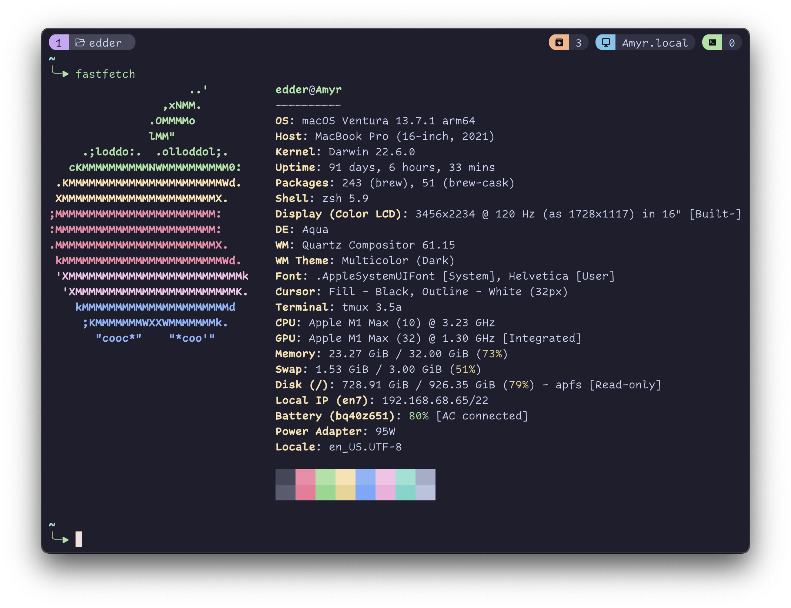

# edder's dotfiles

These dotfiles are subjective, keyboard shorcuts are focused to be more efficient to use with [40% keyboard](https://github.com/edderrd/qmk-crkbd-keymap).



## Pre-requisites

- [Homebrew](https://brew.sh/)
- [Ghostty](https://ghostty.org)
- [NerdFont](https://www.nerdfonts.com/)

## Install

Installation process is mostly based in next steps and `bin/setup.sh` script.

### Secrets

Some files could be uploaded to this repository (for security reasons) so these files must be created to store that sensitive information

```bash
touch ~/.secrets # holds any token accessible for you shell
touch ~/.gitconfig_local # your name and email
```

```ini
# example .gitconfig_local
[user]
    name = Your Name
    email = your@email.com
```

### Dependencies

```bash
brew install zsh git tmux nvim
```

### Initial Setup

Common dotfiles could be linked directly using the script

```bash
./bin/setup.sh
```

### Nerd fonts

To add icons and fancy separators you can install [nerd font](https://www.nerdfonts.com/) specific for you needs, for this dotfiles repository I use [JetBrains Mono](https://www.jetbrains.com/es-es/lp/mono/). You can install it using brew.

```bash
brew install --cask font-jetbrains-mono-nerd-font font-jetbrains-mono-nerd-font
```

### Neovim

I use a [lazyvim](https://www.lazyvim.org/) based neovim configuration, with some extra configuration, refer to the documentation for more information.

### Ghostty

Fast and reliable terminal, new in town.

```bash
brew install --cask ghostty
```

**note:** If you don't like the icon you can search for another icon with extension `.icns` and drag and drop in settings `cmd+i` in app.
